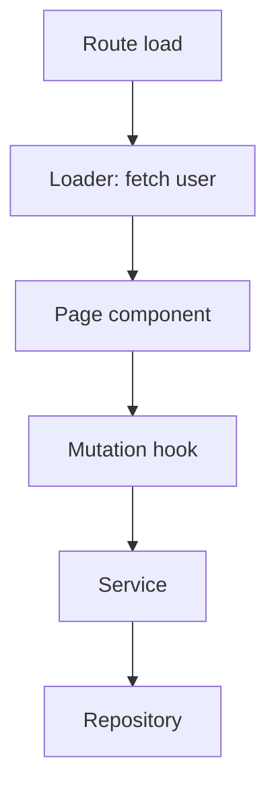

# Implementation Map Template

Use this template after evidence collection. Keep all 9 mandatory sections (including `Artifact Decision`). Include conditional sections only when evidence supports them — omit them cleanly rather than padding.

See [artifact-decision-rules.md](./artifact-decision-rules.md) for how to fill in the `Artifact Decision` section.

---

```markdown
# <Feature Or Module Name> Implementation Map

## Metadata

- Date: `YYYY-MM-DD`
- Repo: `<repo-name>`
- Stack profile: `frontend | backend | full-stack | library/package | mixed/unknown`
- Target: `<feature name, route, file path, or module>`
- Scope: `<one sentence describing what the map covers and excludes>`
- Author: `<agent or person>`

## 30-Second Summary

<Three to five sentences. What the feature does, where it lives, the dominant lifecycle, and the single most important thing a reader should know before touching the code.>

## Stack Profile And Scope

- Profile: `<profile>`
- Included surfaces: `<list — e.g., routes, services, jobs, tests>`
- Excluded surfaces: `<list — e.g., admin panel, billing integration>`

## Start Here

Files to open in order, with a one-line reason each.

| # | File | Why |
|---|------|-----|
| 1 | `<path>` | <reason> |
| 2 | `<path>` | <reason> |
| 3 | `<path>` | <reason> |

## Runtime Flow

Trace the dominant lifecycle from entry point to terminal effect (rendering, response, persistence, navigation, side effect). Use numbered steps and cite files.

1. `<step>` — `<file>[:<symbol>]`
2. `<step>` — `<file>[:<symbol>]`
3. `<step>` — `<file>[:<symbol>]`

If the feature has more than one dominant flow (e.g., create vs. import), give each its own short trace.

## Ownership Boundaries

Who owns what responsibility, by module or layer.

| Boundary | Owns | Files |
|----------|------|-------|
| <e.g., Route layer> | <responsibility> | `<paths>` |
| <e.g., Service layer> | <responsibility> | `<paths>` |
| <e.g., Repository> | <responsibility> | `<paths>` |

If boundaries are unclear in code, say so and label it inference.

## Tests To Read And Test Gaps

| Test file | Covers | Notes |
|-----------|--------|-------|
| `<path>` | <surface> | <notes> |

Test gaps:

- `<gap>` — `<file or surface>` — <why this matters>

Use `None found` when no tests exist.

## File Inventory

A compact, grouped list of files touched by the feature. Group by workflow, not by folder.

### <Workflow group 1>
- `<path>` — <one-line role>
- `<path>` — <one-line role>

### <Workflow group 2>
- `<path>` — <one-line role>

## Artifact Decision

Decision: `<html-artifact | image-artifact | both | neither>`

Reason:
- <evidence-based reason tied to this map's content>

Suggested companion:
- <exact follow-up invocation, or `None`>
```

---

## Conditional Sections

Include only when supported by evidence. Place these after `Ownership Boundaries` and before `Tests To Read And Test Gaps`, in the order shown. `Artifact Decision` stays at the end and is mandatory regardless of which conditional sections are present.

### User Or Business Flow Mapped To Code

For features with a user-visible workflow. Map each step of the user flow to the responsible code path.

```markdown
| Step | What user does | What code runs | Files |
|------|----------------|----------------|-------|
| 1 | <action> | <handler/component/service> | `<paths>` |
```

### Implementation Architecture

Describe layering, composition patterns, dependency direction. Use prose plus a small diagram only if it earns its space.

### State, Data, Persistence, And Side Effects

For features with non-trivial state or persistence.

```markdown
| Store / cache / table / queue | Owner | Read by | Written by | Invalidation / lifecycle |
|---|---|---|---|---|
| <name> | <file> | <files> | <files> | <trigger> |
```

### API, Request, Contract, Or Messaging Layer

Endpoints, helpers, DTOs, events, schemas — whichever the feature uses.

```markdown
| Surface | Direction | Contract source | Consumer | Notes |
|---|---|---|---|---|
| <route or topic> | in/out | `<file>` | `<file>` | <notes> |
```

### Error Handling, Guards, And Permissions

When the feature has authentication, authorization, guarded actions, or non-trivial error paths.

- Guard: `<file>:<symbol>` — applies to `<scope>`
- Failure mode: `<failure>` — handled in `<file>:<symbol>` — user-visible effect: `<description>`

### Current Behavior To Preserve

Invariants a future implementer must not break — auth rules, payment behavior, workflow ordering, migration constraints, user-visible contracts. Cite files.

### Coupling, Complexity, And Refactoring Opportunities

Each candidate must be tied to concrete evidence. Use review-candidate language, not defect language, for low-confidence signals.

| Candidate | Signal | Files | Confidence |
|---|---|---|---|
| <e.g., split orchestration component> | <e.g., file owns route load + mutation + dialogs + navigation> | `<paths>` | high / review |

### Visuals

Include at least one flow description for medium or complex features. Express as Mermaid, ASCII, or a table-driven step list — whichever the downstream artifact skill can use faithfully.

````markdown

````

### Review Notes

Open questions, ambiguities, areas the next reader should verify. Not the same as gaps — review notes flag uncertainty in the map itself.

---

## Section Selection Heuristics

- Frontend-only feature with no significant state: drop `State, data, persistence`.
- Backend service with no user flow: drop `User or business flow`.
- Pure library/package: drop `Error handling, guards, and permissions` unless the package implements its own.
- Small but legitimate feature: keep mandatory sections, add at most one or two conditional sections.
- Complex full-stack vertical: include most conditional sections plus visuals.
